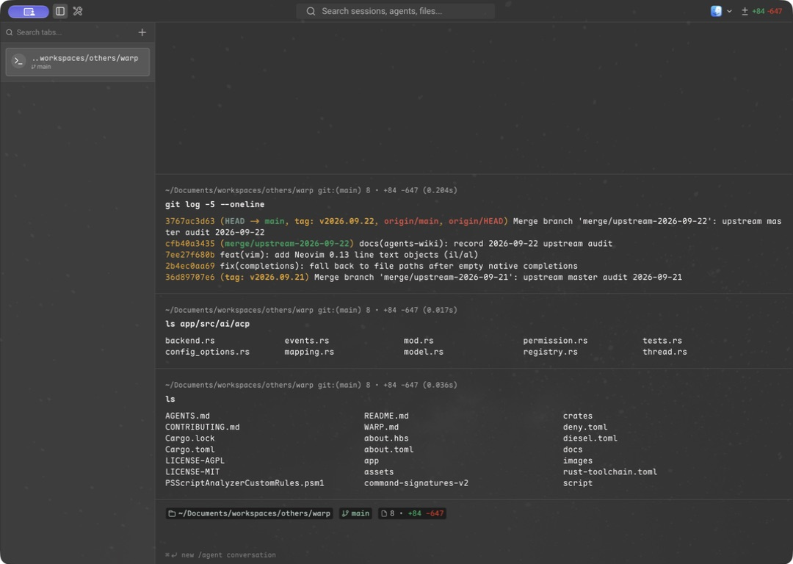

<h1 align="center">Warply</h1>

<p align="center">A native macOS terminal with your choice of AI agent.</p>

<p align="center">
  <a href="https://github.com/zhangyu1818/warply/releases/latest">Download</a> ·
  <a href="#getting-started">Getting started</a> ·
  <a href="#build-from-source">Build from source</a> ·
  <a href="https://github.com/zhangyu1818/warply/issues">Issues</a>
</p>



Warply is an independent fork of [Warp](https://github.com/warpdotdev/warp), focused on a local-first terminal experience for macOS. It keeps Warp’s terminal and native interface, connects agent conversations through the Agent Client Protocol (ACP), and removes dependencies on Warp accounts, hosted AI, cloud services, and telemetry.

## Features

- **A terminal built for everyday work.** Command blocks, an editable command input, completions, searchable history, tabs, and split panes.
- **Bring your own agent.** Use ACP-compatible agents in the integrated conversation UI, with streamed responses, plans, permission requests, tool activity, and diffs.
- **Choose your suggestion provider.** Configure an OpenAI-compatible endpoint for Next Command and Prompt Suggestions, independently of your ACP agent.
- **Keep your work local.** Local conversation history, saved workflows, prompts, and terminal sessions.
- **Work across machines over SSH.** Remote terminals, remote file browsing, and Warpify shell integration remain part of the terminal experience.
- **Made for macOS.** Native windowing, themes, keyboard shortcuts, and Sparkle updates from Warply’s GitHub releases.

Warply does not require a Warp account. AI providers and agents may require their own credentials and network access. MCP servers and skills are configured in your chosen agent, which owns their execution.

## Getting started

### Install

Download `Warply.dmg` from the [latest release](https://github.com/zhangyu1818/warply/releases/latest), open it, and drag **Warply** into **Applications**.

The release workflow currently produces **macOS Apple Silicon (arm64)** builds. Linux and Windows desktop clients are outside this fork’s scope.

### Connect an AI agent

1. Open **Settings → AI → ACP Agent**.
2. Choose an **Agent backend** from the ACP registry.
3. Make sure its required launcher is available: Node.js / `npx`, `uvx`, or the agent’s installed binary, depending on the backend. Follow the selected agent’s setup and authentication instructions.
4. Configure the options exposed by that agent and start a new agent conversation.

Available models and session options depend on the selected agent. Warply renders ACP events and permission requests; the agent provides the model connection, tools, MCP servers, and skills.

### Configure terminal suggestions

In **Settings → AI → Terminal Suggestions**, set your provider’s **Endpoint**, **API key**, and **Model**. These settings power Next Command and Prompt Suggestions separately from agent conversations.

## Build from source

You will need macOS, the full **Xcode** application, **Homebrew**, **Rust via rustup**, and **Git LFS**. The Rust version is pinned in [`rust-toolchain.toml`](rust-toolchain.toml).

```sh
brew install git-lfs
git clone https://github.com/zhangyu1818/warply.git
cd warply
./script/bootstrap
./script/run
```

Bootstrap fetches Git LFS assets, prepares Xcode, and installs build and test dependencies. It may request administrator access for Xcode setup. `./script/run` builds, bundles, and launches `Warply.app`; use `./script/run --release` for a release build.

The application binary is named `warply`. The Cargo package retains the upstream name `warp`, so targeted checks use `-p warp`:

```sh
cargo fmt -- --check
cargo check -p warp --all-targets --locked --message-format short
cargo check --workspace --all-targets --locked --message-format short
cargo nextest run -p warp -E 'test(slash_command) | test(acp) | test(terminal_suggestions)'
```

See [`CONTRIBUTING.md`](CONTRIBUTING.md) for contribution and validation guidance, and [`docs/agents-wiki/`](docs/agents-wiki/README.md) for the fork’s architecture and upstream merge records.

## Contributing

Bug reports and focused pull requests are welcome in the [Warply repository](https://github.com/zhangyu1818/warply). Include reproduction steps, your macOS version, and the Warply version when reporting a problem.

Compatible upstream terminal and local UI improvements are reviewed and selectively ported. Changes must preserve the macOS-only, ACP-backed architecture. Read [`AGENTS.md`](AGENTS.md) and the [fork contract](docs/agents-wiki/fork-contract.md) before contributing.

## Credits and license

Warply builds on the work of the Warp authors and contributors. It is an independent project and is not affiliated with or endorsed by Warp / Denver Technologies, Inc.

The `warpui_core` and `warpui` crates are licensed under [MIT](LICENSE-MIT). The rest of the repository is licensed under [AGPL-3.0](LICENSE-AGPL). Upstream copyright notices and third-party license notices are retained.
